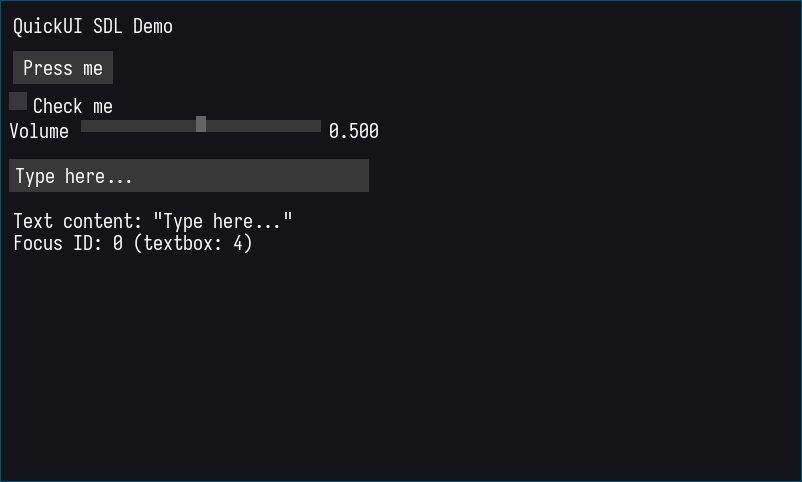

# QUICK-UI Documentation

An immediate mode UI library written in C for creating simple, efficient user interfaces.

> **WARNING**: Only compatible with SDL2 and Raylib at this moment.

## Installation

### Prerequisites To Build Examples
Install the required graphics libraries:

**Arch Linux:**
```bash
sudo pacman -S sdl2
```

**Ubuntu/Debian:**
```bash
sudo apt-get install libsdl2-dev
```

**For Raylib support**, I have done a constructed a build script so it will do that for you.

### Building
1. Clone or download the QUICK-UI source files
2. Include `quickui.h` in your project
3. Compile `quickui.c` with your project
4. Link against SDL2 or Raylib

## Example




## Core Concepts

### Immediate Mode
QUICK-UI follows the immediate mode paradigm where UI elements are created and destroyed each frame. There's no persistent widget state - you call widget functions every frame and they return their current interaction state.

### Context
The `qui_Context` structure holds all UI state including:
- Mouse and keyboard input state
- Active/hot widget tracking
- Rendering callbacks
- Layout cursor position
- Color scheme

### Widget IDs
Widgets are automatically assigned unique IDs each frame for interaction tracking. The library handles hot (mouse over) and active (being interacted with) states automatically.

## API Reference

### Core Functions

#### `void qui_init(qui_Context *ctx, void *user_data)`
Initialize a UI context. Must be called before using any other functions.
- `ctx`: Pointer to context structure
- `user_data`: Optional user data pointer (can be NULL)

#### `void qui_begin(qui_Context *ctx, float start_x, float start_y)`
Begin a new UI frame at the specified position.
- `start_x`, `start_y`: Starting cursor position for widgets

#### `void qui_end(qui_Context *ctx)`
End the current UI frame. Resets input states for next frame.

### Input Functions

#### `void qui_mouse_down(qui_Context *ctx, int x, int y)`
Register a mouse button press event.

#### `void qui_mouse_up(qui_Context *ctx, int x, int y)`
Register a mouse button release event.

#### `void qui_mouse_move(qui_Context *ctx, int x, int y)`
Update mouse position.

#### `void qui_feed_key_backspace(qui_Context *ctx)`
Register a backspace key press (for text input).

#### `void qui_feed_key_enter(qui_Context *ctx)`
Register an enter key press.

### Rendering Setup

#### `void qui_set_font(qui_Context *ctx, void *font, float font_size, float font_spacing)`
Set font information for text rendering.

You must set these callback functions in your context:
- `ctx->draw_rect`: Function to draw rectangles
- `ctx->draw_text`: Function to draw text
- `ctx->text_width`: Function to measure text width
- `ctx->text_height`: Function to measure text height

### Utility Functions

#### `qui_Vec2 qui_vec2(int x, int y)`
Create a 2D vector.

#### `qui_Rect qui_rec(int width, int height, int pos_x, int pos_y)`
Create a rectangle structure.

## Widget Guide

### Button
```c
int qui_button(qui_Context *ctx, const char *label)
```
Creates a clickable button.
- **Returns**: 1 if clicked this frame, 0 otherwise
- **Parameters**: 
  - `label`: Button text

**Example:**
```c
if (qui_button(&ui, "Save File")) {
    save_current_file();
}
```

### Checkbox
```c
int qui_checkbox(qui_Context *ctx, const char *label, int *value)
```
Creates a checkbox with a label.
- **Returns**: 1 if value changed this frame, 0 otherwise
- **Parameters**:
  - `label`: Checkbox label text
  - `value`: Pointer to boolean value (0 or 1)

**Example:**
```c
int show_debug = 0;
if (qui_checkbox(&ui, "Show Debug Info", &show_debug)) {
    printf("Debug mode: %s\n", show_debug ? "ON" : "OFF");
}
```

### Slider
```c
int qui_slider_float(qui_Context *ctx, const char *label, float *value, float minv, float maxv, float width)
```
Creates a horizontal slider for float values.
- **Returns**: 1 if interacted with (always returns 1 currently)
- **Parameters**:
  - `label`: Slider label
  - `value`: Pointer to float value to modify
  - `minv`, `maxv`: Minimum and maximum values
  - `width`: Slider width in pixels (0 for default)

**Example:**
```c
float volume = 0.7f;
qui_slider_float(&ui, "Volume", &volume, 0.0f, 1.0f, 200.0f);
```

### Text Box
```c
int qui_textbox(qui_Context *ctx, char *buffer, size_t cap, float width)
```
Creates a text input field.
- **Returns**: 1 if focused, 0 otherwise
- **Parameters**:
  - `buffer`: Character buffer to edit
  - `cap`: Buffer capacity
  - `width`: Text box width in pixels (0 for default)

**Example:**
```c
char username[64] = "";
if (qui_textbox(&ui, username, sizeof(username), 250.0f)) {
    // Text box is focused
}
```

## Examples

### Simple Raylib Example

```c
#include "quickui.h"
#include "raylib.h"

void raylib_draw_rect(qui_Context *ctx, float x, float y, float w, float h, qui_Color col) {
    DrawRectangle((int)x, (int)y, (int)w, (int)h, (Color){col.r, col.g, col.b, col.a});
}

void raylib_draw_text(qui_Context *ctx, const char *text, float x, float y) {
    DrawText(text, (int)x, (int)y, 20, WHITE);
}

float raylib_text_width(qui_Context *ctx, const char *text) {
    return (float)MeasureText(text, 20);
}

float raylib_text_height(qui_Context *ctx, const char *text) {
    return 20.0f;
}

int main() {
    InitWindow(800, 600, "QUICK-UI Demo");
    
    qui_Context ui;
    qui_init(&ui, NULL);
    ui.draw_rect = raylib_draw_rect;
    ui.draw_text = raylib_draw_text;
    ui.text_width = raylib_text_width;
    ui.text_height = raylib_text_height;
    
    int checkbox_val = 0;
    float slider_val = 50.0f;
    
    while (!WindowShouldClose()) {
        if (IsMouseButtonPressed(MOUSE_BUTTON_LEFT))
            qui_mouse_down(&ui, GetMouseX(), GetMouseY());
        if (IsMouseButtonReleased(MOUSE_BUTTON_LEFT))
            qui_mouse_up(&ui, GetMouseX(), GetMouseY());
        qui_mouse_move(&ui, GetMouseX(), GetMouseY());
        
        BeginDrawing();
        ClearBackground(DARKGRAY);
        
        qui_begin(&ui, 20, 20);
        qui_button(&ui, "Hello World!");
        qui_checkbox(&ui, "Enable Feature", &checkbox_val);
        qui_slider_float(&ui, "Value", &slider_val, 0.0f, 100.0f, 200.0f);
        qui_end(&ui);
        
        EndDrawing();
    }
    
    CloseWindow();
    return 0;
}
```

## Integration

### Custom Rendering Backend
To use QUICK-UI with any graphics library, implement these four callback functions:

1. **draw_rect**: Fill a rectangle with a solid color
2. **draw_text**: Render text at a position
3. **text_width**: Measure text width in pixels
4. **text_height**: Measure text height in pixels

### Layout System
Widgets are laid out vertically by default. The cursor automatically moves down after each widget by the widget height plus `spacing_y`. You can modify `cursor_x` and `cursor_y` manually for custom layouts.

### Color Customization
Modify these color fields in the context:
- `col_box`: Default widget background
- `col_box_hot`: Widget background when mouse hovers
- `col_box_active`: Widget background when pressed/focused
- `col_text`: Text color

## License

QUICK-UI is licensed under the GNU General Public License v3.0. See the LICENSE file for details.

## Contributing

This library is in early development. Currently supports:
- Buttons
- Checkboxes
- Float sliders
- Text input boxes

Things that are not supported include:
- Text character input (partial support)
- List boxes
- Combo boxes
- Tabs
- Windows/panels

Feel free to contribute to this project.
