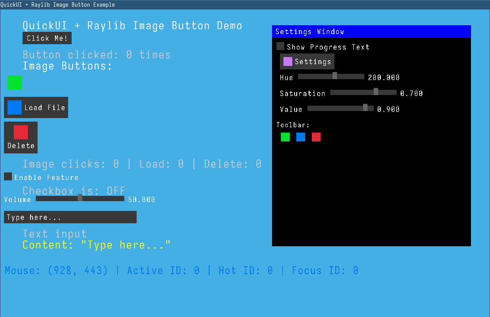

# QUICK-UI Documentation

An immediate mode UI library written in C for creating simple, efficient user interfaces.

## Demo
Refer to the demo directory if u want to reference how the api works.

### Building
1. Clone or download the QUICK-UI source files
2. Include `quickui.h` in your project
3. Compile `quickui.c` with your project
4. Link against SDL2 or Raylib

## Example

### Context
The `qui_Context` structure holds all UI state including:
- Mouse and keyboard input state
- Active/hot widget tracking
- Rendering callbacks
- Layout cursor position
- Color scheme

### Widget IDs
Widgets are automatically assigned unique IDs each frame for interaction tracking. The library handles hot (mouse over) and active (being interacted with) states automatically.

## API Reference

### Core Functions

#### `void qui_init(qui_Context *ctx, void *user_data)`
Initialize a UI context. Must be called before using any other functions.
- `ctx`: Pointer to context structure
- `user_data`: Optional user data pointer (can be NULL)

#### `void qui_begin(qui_Context *ctx, float start_x, float start_y)`
Begin a new UI frame at the specified position.
- `start_x`, `start_y`: Starting cursor position for widgets

#### `void qui_end(qui_Context *ctx)`
End the current UI frame. Resets input states for next frame.

## License

QUICK-UI is licensed under the GNU General Public License v3.0. See the LICENSE file for details.

## Contributing

This library is in early development. Currently supports:
- Buttons
- Checkboxes
- Float sliders
- Text input boxes
- Windows/panels

Things that are not supported include:
- Text character input (partial support)
- List boxes
- Combo boxes

Feel free to contribute to this project.
