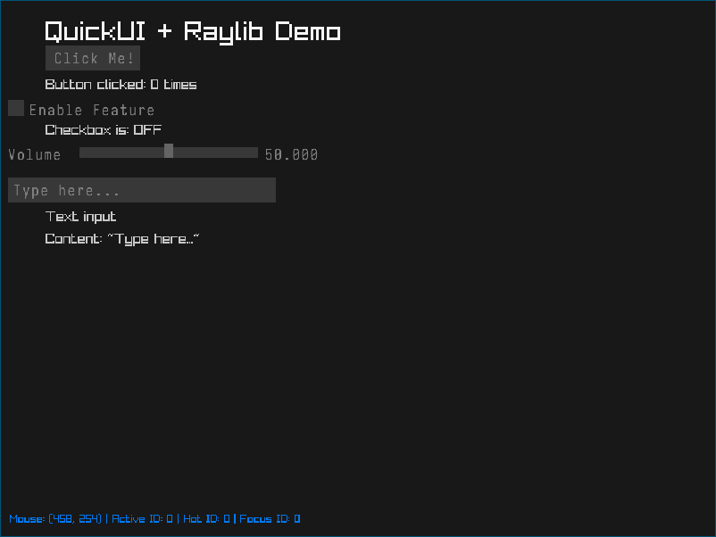

# QUICK-UI Documentation

An immediate mode UI library written in C for creating simple, efficient user interfaces.

## Demo
Refer to the demo directory if u want to reference how the api works.

### Building
It is a single stand alone Immediate GUI header for those who just want simplicity

## Example



### Context
The `qui_Context` structure holds all UI state including:
- Mouse and keyboard input state
- Active/hot widget tracking
- Rendering callbacks
- Layout cursor position
- Color scheme

### Widget IDs
Widgets are automatically assigned unique IDs each frame for interaction tracking. The library handles hot (mouse over) and active (being interacted with) states automatically.

## API Reference

### Core Functions

#### `void qui_init(qui_Context *ctx, void *user_data)`
Initialize a UI context. Must be called before using any other functions.
- `ctx`: Pointer to context structure
- `user_data`: Optional user data pointer (can be NULL)

#### `void qui_begin(qui_Context *ctx, float start_x, float start_y)`
Begin a new UI frame at the specified position.
- `start_x`, `start_y`: Starting cursor position for widgets

#### `void qui_end(qui_Context *ctx)`
End the current UI frame. Resets input states for next frame.

## Basic - Examples

### Simple Raylib Example

```c
#include "quickui.h"
#include "raylib.h"

void raylib_draw_rect(qui_Context *ctx, float x, float y, float w, float h, qui_Color col) {
    DrawRectangle((int)x, (int)y, (int)w, (int)h, (Color){col.r, col.g, col.b, col.a});
}

void raylib_draw_text(qui_Context *ctx, const char *text, float x, float y) {
    DrawText(text, (int)x, (int)y, 20, WHITE);
}

float raylib_text_width(qui_Context *ctx, const char *text) {
    return (float)MeasureText(text, 20);
}

float raylib_text_height(qui_Context *ctx, const char *text) {
    return 20.0f;
}

int main() {
    InitWindow(800, 600, "QUICK-UI Demo");
    
    qui_Context ui;
    qui_init(&ui, NULL);
    ui.draw_rect = raylib_draw_rect;
    ui.draw_text = raylib_draw_text;
    ui.text_width = raylib_text_width;
    ui.text_height = raylib_text_height;
    
    int checkbox_val = 0;
    float slider_val = 50.0f;
    
    while (!WindowShouldClose()) {
        if (IsMouseButtonPressed(MOUSE_BUTTON_LEFT))
            qui_mouse_down(&ui, GetMouseX(), GetMouseY());
        if (IsMouseButtonReleased(MOUSE_BUTTON_LEFT))
            qui_mouse_up(&ui, GetMouseX(), GetMouseY());
        qui_mouse_move(&ui, GetMouseX(), GetMouseY());
        
        BeginDrawing();
        ClearBackground(DARKGRAY);
        
        qui_begin(&ui, 20, 20);
        qui_button(&ui, "Hello World!");
        qui_checkbox(&ui, "Enable Feature", &checkbox_val);
        qui_slider(&ui, "Value", &slider_val, 0.0f, 100.0f, 200.0f);
        qui_end(&ui);
        
        EndDrawing();
    }
    
    CloseWindow();
    return 0;
}
```
## License

QUICK-UI is licensed under the GNU General Public License v3.0. See the LICENSE file for details.

## Contributing

This library is in early development. Currently supports:
- Buttons
- Checkboxes
- Float sliders
- Text input boxes
- Windows/panels

Things that are not supported include:
- Text character input (partial support)
- List boxes
- Combo boxes

Feel free to contribute to this project.
